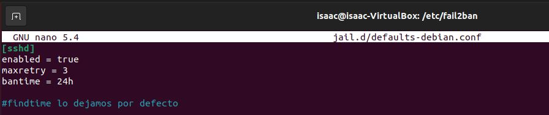

# FAIL2BAN
FAIL2BAN es una aplicación de Linux, que nos permite controlar y denegar conexiones de IPs no autorizadas a nuestro servidor.
Estas acciones las realiza al bloquear o banear a las IPs que realizan varios intentos fallidos de acceso a nuestro servidor (ataques de fuerza bruta).

Se distribuye bajo licencia GNU y funciona en sistemas POSIX.

Vamos a explicar la instalación y configuración de FAIL2BAN.

## Instalación

Para instalar FAIL2BAN solo tendremos que poner en Ubuntu el comando: 
**sudo apt install -y fail2ban**

## Configuración

Una vez lo tengamos instalado deberemos ir al fichero de configuración para añadir nuestras reglas de conexión.

El fichero es: **/etc/fail2ban/jail.conf**, pero no es recomendable modificarlo por temas de actualizaciones.
En este caso nos vamos a centrar en tres parámetros los cuales son:
- bantime: tiempo que pasará la IP baneada
- findtime: tiempo en el que deben darse las conincidencias para ser baneado
- maxretry: intentos para ser baneado

Hay otras opciones que son interesantes, pero en este caso no vamos a configurarlas:

- destmail: es el email de destino
- mta: el mta que usaremos que por defecto es sendmail, pero podemos cambiarlo
- port: puerto al que será redireccionada la IP baneada

Para poner nuestras propias reglas de conexión deberemos modificar el siguiente fichero: **/etc/fail2ban/jail.d/defaults-debian.conf**

También podemos crear el fichero ***jail.local*** en la ruta **/etc/fail2ban/jail.local** y añadir nuestras reglas, pero mi preferencia es usar el fichero que ya viene para ello.

Una vez hayamos modificado nuestras reglas reiniciaremos FAIL2BAN: **sudo service fail2ban restart** y miraremos el fichero log.

Podemos ver que los parámetros que nos muestra son los establecidos por mí en el fichero local.

Además podemos ver el estado de nustras "jaulas" (paramétros de FAIL2BAN configurados por nosotros anteriormente) con el siguiente comando: **sudo fail2ban-client status**

En un futuro si queremos ver cuantas IPs tenemos beneadas el comando será: **sudo fail2ban-client status sshd**

## EJEMPLOS
### Ejemplo 1
En el primer ejemplo vamos ignorar nuestra propia IP y por mucho que nos equivoquemos no bloqueará la IP.

En este caso mi IP del servidor es: 192.168.1.125

Tras poner que ignore la IP probaremos la conexión, primero fallando los tres intentos para ver que no nos bloquea y por último nos conectaremos con nuestra propia IP.

Nos equivocamos en los tres intentos.

Ahora vamos a volver a intentarlo ya que no nos ha bloqueado.

Podemos observar que el intento de sesión con nuestra propia IP no se ha registrado en el fichero log.

### Ejemplo 2
El segundo ejemplo será un poco más realista.
Ignoraremos una IP del rango del servidor.

Haremos como en el primer ejemplo, primero nos equivocaremos en los tres intentos y luego nos conectaremos viendo que no nos ha bloqueado.

Vamos a fallar en los tres intentos.

No nos ha bloqueado por lo que nos vamos a repetir la conexión, esta vez conectándonos.

### Ejemplo 3

El último ejemplo lo realizaremos con un vídeo ya que haremos un ataque de fuerza bruta con una IP, a la que no hemos especificado que sea ignorada y la cual al fallar tres veces nos bloqueará la IP durante 24 horas hasta poder intentarlo de nuevo.

También veremos los logs de FAIL2BAN para comprobar lo que ha ido sucediendo con el ataque de fuerza bruta.

## Desbanear IP

Para desbloquear una IP la cual no queremos que esté baneada debemos poner el siguiente comando: **sudo fail2ban-client unban IP-BANEADA**

Por ejemplo, si tenemos baneada la IP 192.168.156

Para desbanearla pondríamos el comando: **sudo fail2ban-client unban 192.168.1.56**

Esto nos dará como salida un 1 en referencia a que una IP se ha desbaneado y al mirar iptables con el comando: **sudo iptables -L** veremos que la IP que estaba baneada ya no estará, e incluso viendo el fichero de los logs veremos que está desbaneada.

## ENLACE AL VÍDEO

[Vídeo FAIL2BAN](https://www.youtube.com/watch?v=lYviX8mbK4M)

### BIBLIOGRAFÍA
- https://programmerclick.com/article/3350758799/
- https://www.arsys.es/blog/instalar-fail2ban
- https://www.youtube.com/watch?v=5sE2Mici96o
