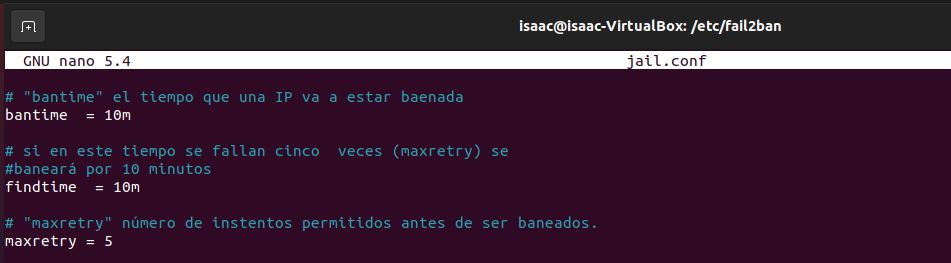
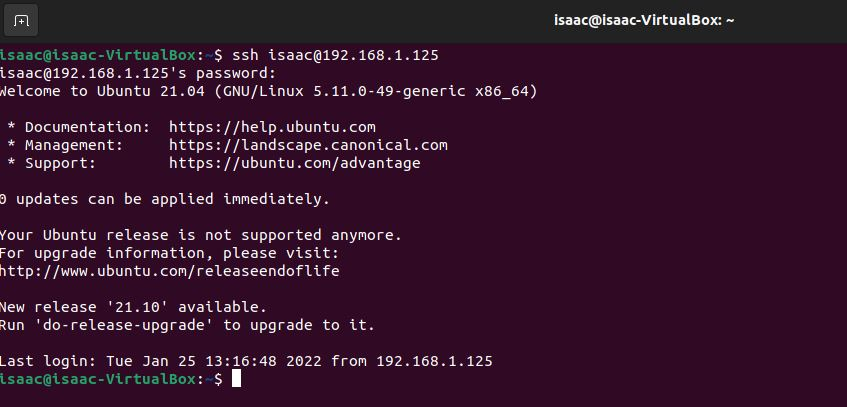

# FAIL2BAN
FAIL2BAN es una aplicación de Linux, que nos permite controlar y denegar conexiones de IPs no autorizadas a nuestro servidor.
Estas acciones las realiza al bloquear o banear a las IPs que realizan varios intentos fallidos de acceso a nuestro servidor (ataques de fuerza bruta).

Se distribuye bajo licencia GNU y funciona en sistemas POSIX.

Vamos a explicar la instalación y configuración de FAIL2BAN.

## Instalación

Para instalar FAIL2BAN solo tendremos que poner en Ubuntu el comando: 
**sudo apt install -y fail2ban**

## Configuración

Aunque el fichero de configuración es: **/etc/fail2ban/jail.conf**, no debemos configurar nada en este archivo ya que si actua un fichero local como puede ser **jail.conf** o **defaults-debian.conf**
se antepondran dichas reglas.

Los parámetros que nos interesan modificar en nuestro fichero local (en mi caso usaré: **defaults-debian.conf**) y los cuales se cuentran en: **/etc/fail2ban/jail.conf**, son:

- **bantime**: tiempo que pasará la IP baneada
- **findtime**: tiempo en el que deben darse las coincidencias para ser baneado (findtime y maxretry)
- **maxretry**: intentos para ser baneado

Además de estas, hay otras opciones que son interesantes, pero en este caso no vamos a configurarlas.

Dichas opciones son las siguientes:

- **destemail**: email de destino
- **mta**: mta que usaremos que por defecto es sendmail, pero podemos cambiarlo
- **port**: puerto al que será redireccionada la IP baneada

El fichero donde vamos a configurar nuestras reglas es: **/etc/fail2ban/jail.d/defaults-debian.conf**

Una vez hayamos modificado nuestras reglas reiniciaremos FAIL2BAN: **sudo service fail2ban restart** y miraremos el fichero log.

Podemos ver que los parámetros que nos muestra son los establecidos por mí en el fichero local.

Además podemos ver el estado de nustras "jaulas" con el siguiente comando: **sudo fail2ban-client status**

En un futuro si queremos ver cuantas IPs tenemos beneadas el comando será: **sudo fail2ban-client status sshd**

# EJEMPLOS

## Ejemplo 1

Ignoraremos una IP del rango del servidor, para que cuando falle los tres intentos no nos bloquee la IP y pueda volver a intentar .

Haremos como en el primer ejemplo, primero nos equivocaremos en los tres intentos y luego nos conectaremos viendo que no nos ha bloqueado.

Vamos a fallar en los tres intentos.

No nos ha bloqueado por lo que nos vamos a repetir la conexión, esta vez conectándonos.

## Ejemplo 2

El último ejemplo lo realizaremos con un vídeo ya que haremos un ataque de fuerza bruta con una IP, a la que no hemos especificado que sea ignorada y la cual al fallar tres veces nos bloqueará la IP durante 24 horas hasta poder intentarlo de nuevo.

También veremos los logs de FAIL2BAN para comprobar lo que ha ido sucediendo con el ataque de fuerza bruta.

### ENLACE AL VÍDEO

[Vídeo FAIL2BAN](https://www.youtube.com/watch?v=lYviX8mbK4M)

## Desbanear IP

Para desbloquear una IP la cual no queremos que esté baneada debemos poner el siguiente comando: **sudo fail2ban-client unban IP-BANEADA**

Por ejemplo, si tenemos baneada la IP 192.168.156

Para desbanearla pondríamos el comando: **sudo fail2ban-client unban 192.168.1.56**

Esto nos dará como salida un 1 en referencia a que una IP se ha desbaneado y al mirar iptables con el comando: **sudo iptables -L** veremos que la IP que estaba baneada ya no estará, e incluso viendo el fichero de los logs veremos que está desbaneada.

## BIBLIOGRAFÍA
- https://programmerclick.com/article/3350758799/
- https://www.arsys.es/blog/instalar-fail2ban
- https://www.youtube.com/watch?v=5sE2Mici96o
